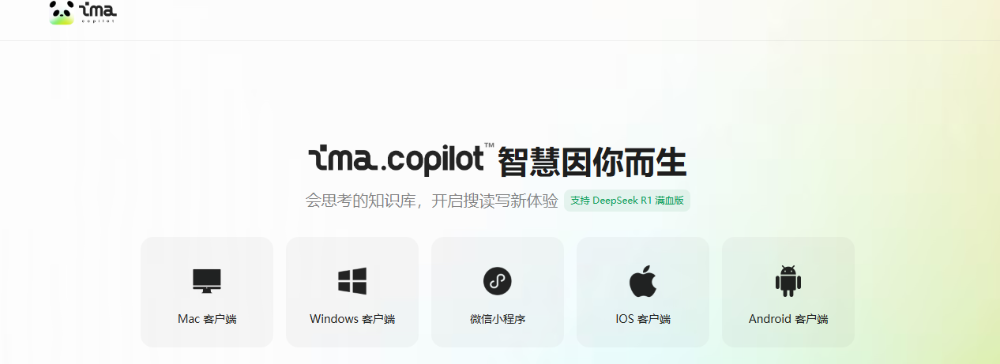
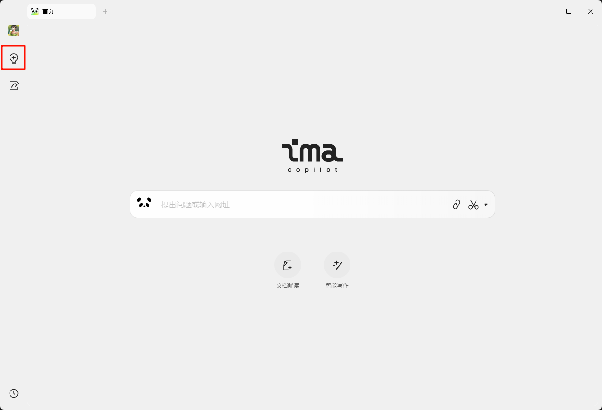
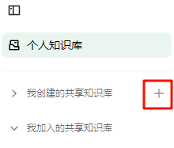
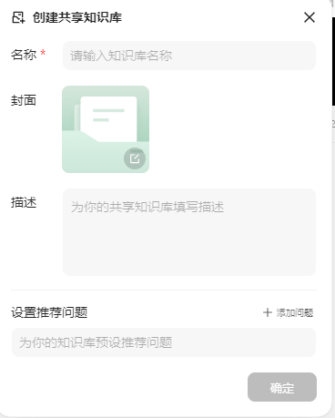
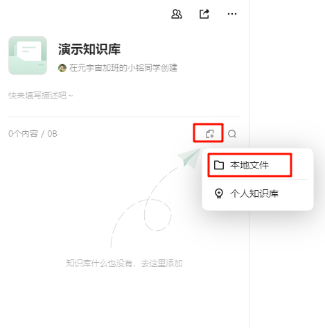
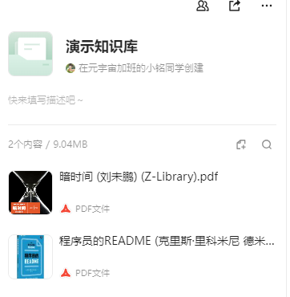
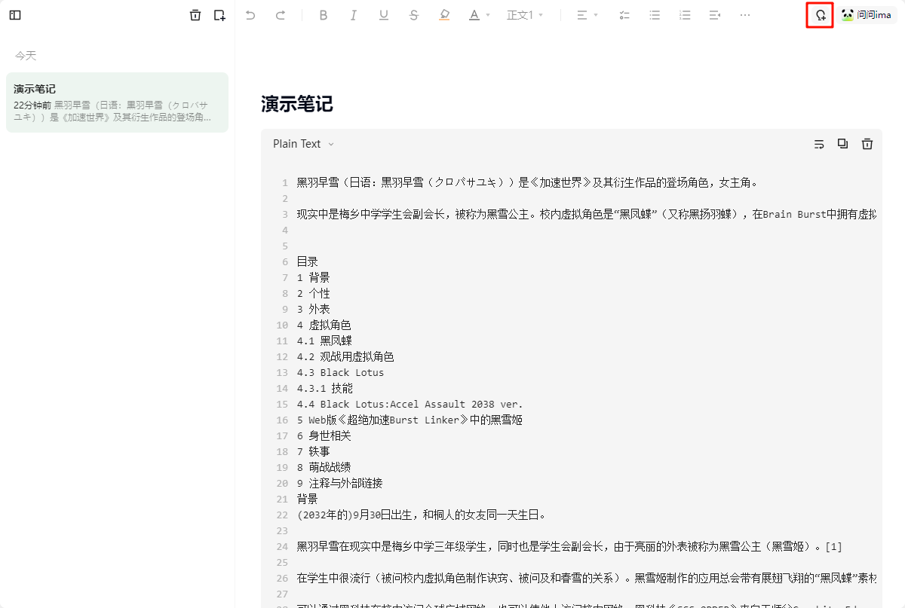
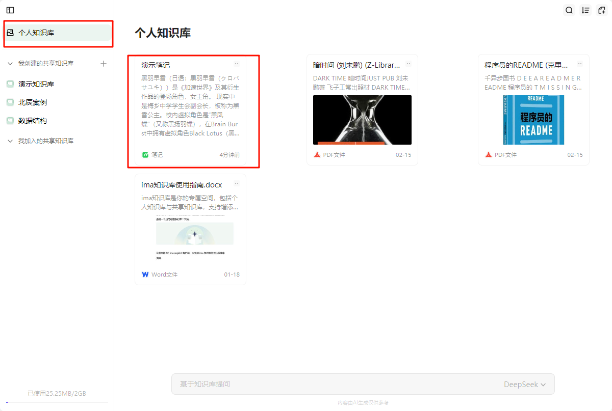
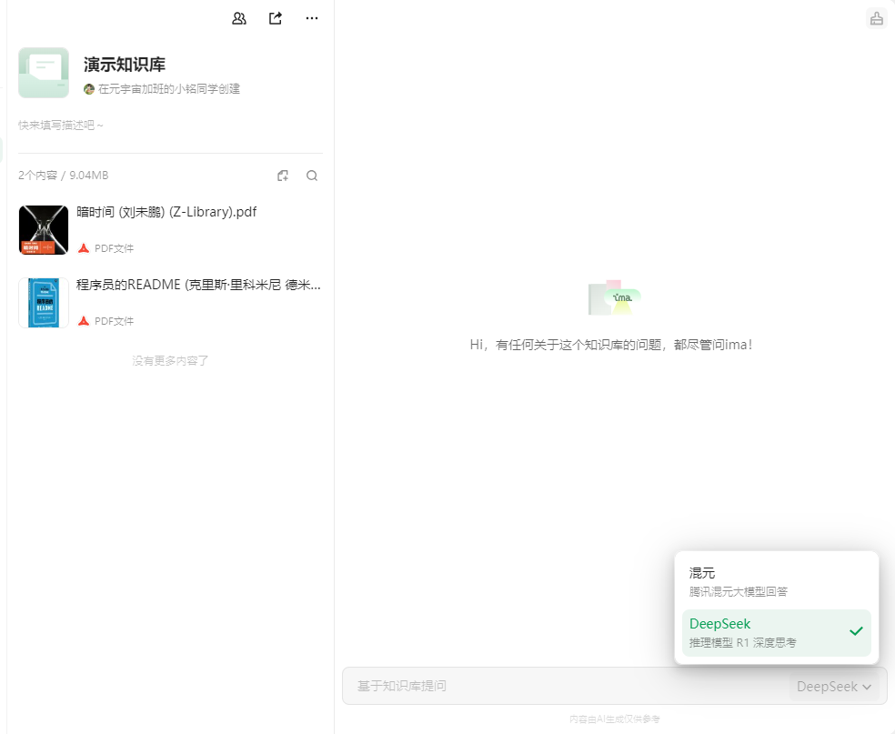
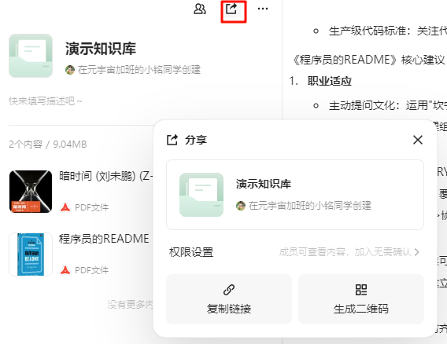

在信息爆炸的时代，我们每天都被海量的文档、资料和数据所包围。如何从中高效提取并整理出有价值的信息，已经成为每个人必须面对的重要课题。

幸运的是，人工智能（AI）技术为我们提供了一种全新的解决方案——RAG（Retrieval-Augmented Generation，检索增强生成） 。RAG技术通过将检索与生成相结合，使大模型在回答问题时能够主动从外部知识库中查找相关信息。这种类似人类“查资料”的方式，不仅提升了回答的准确性，还有效避免了大模型“瞎编”答案的问题。

[RAG技术介绍](../../硬知识/rag-intro/)

本文将带领大家使用基于RAG技术的腾讯ima.copilot（以下简称ima），并结合Deepseek大模型，快速构建一个专属于自己的个人知识库。通过这一工具，你将能够轻松实现从多个文档中提取所需信息，极大提升工作效率和学习效果。

值得一提的是，目前腾讯ima.copilot完全免费开放使用！

## 使用场景

你是否遇到过这样的场景：手头有多个文档需要分析，但普通的大模型只能逐一处理单个文档。

传统的大模型虽然功能强大，但在处理多文档时存在明显局限性，甚至可能因缺乏上下文而“胡编乱造”。

通过建立个人知识库，你可以将所有相关文档上传到系统中，然后直接向知识库提问。系统会根据你的文档内容生成精准的回答，并标注信息来源，确保答案的准确性和可信度。

例如：

- 学术研究 ：你需要从多篇论文中提取关键信息并进行对比分析。

- 项目管理 ：整理团队成员提交的报告，快速找到问题的答案。

- 学习备考 ：将教材、笔记和习题集整合到一起，随时复习和提问。

有了个人知识库，这些问题都能迎刃而解！

## 软件安装

要开始使用腾讯ima，首先需要安装相关软件。以下是不同设备上的安装方法：

访问网页：https://ima.qq.com/

点击下载需要的版本（如Windows、Mac、手机端等）。

## 使用方法

### 第一步：创建知识库

打开腾讯IMA应用，进入“知识库”页面。

在“我创建的共享知识库”旁边点击+按钮，可以创建新主题的知识库

输入知识库的名称并点击确定，即可创建知识库。

### 第二步：上传文档

点击指定图标，选择“本地文件”选项，上传你的文档。支持格式包括：PDF、DOC、DOCX、JPEG、PNG、JPG等。

系统会自动对文档内容进行解析和索引，方便后续查询。

### 第三步：上传自己的资料

除了上传文档，你还可以将自己的想法或与其他平台大模型交流的结果记录下来。

点击“笔记”页面，新建笔记并将点击右上角的图标，将内容保存到个人知识库。

需要注意的是，目前暂不支持将笔记和问答保存到创建的知识库内，仅能在个人知识库中对笔记进行提问。

### 第四步：提问与交互

在知识库页面的对话框旁边，可以选择使用腾讯自研的混元大模型，或者是DeepSeek大模型。

在知识库页面的对话框中输入你的问题，例如：“请总结一下我上传的这几份报告的核心观点。”

系统会基于上传的文档内容生成回答，并附上具体的文档来源。

如果需要更详细的信息，可以点击来源链接查看原文。

### 第五步：优化与扩展

文档压缩 ：如果PDF文档容量超过100MB，可以使用MinerU工具提取文字内容，从而大幅压缩体积后再上传到知识库。

导入视频和音频 ：目前系统尚不支持直接导入视频和音频文件，但可以通过通义听悟等工具将音频转录为文字，导出为文档后上传至知识库。

权限设置 ：如果需要与他人共享知识库，可以点击“分享”按钮，生成链接并与团队成员协作。

## 总结

通过以上步骤，你就能轻松建立一个高效的个人知识库，并充分利用RAG技术实现智能化的信息管理。无论是工作还是学习，这都将成为你不可或缺的得力助手！