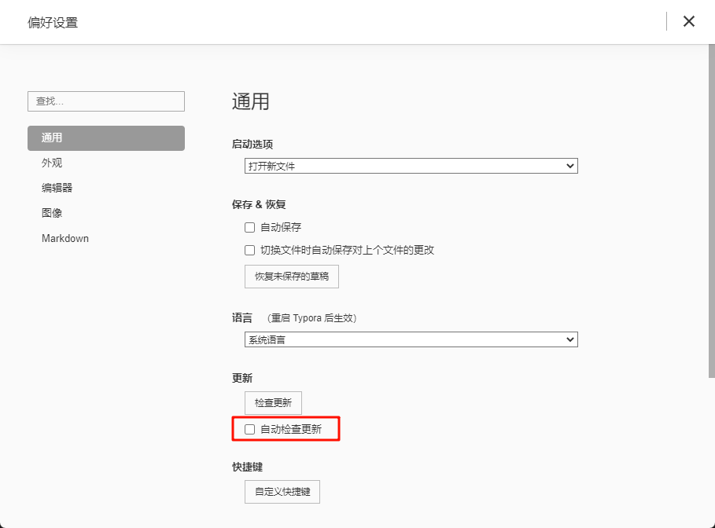

作者：小铭

> Typora 是一个开源的 Markdown 编辑器，支持 Windows、Mac、Linux 等平台。

## 下载地址

### Windows 用户

~~下载地址： https://github.com/iuxt/src/releases/download/2.0/typora-0-11-18.exe~~

0.11.18 现在被远程施法了，会提示过期无法使用,可以使用 0.9.96 版

下载地址：https://github.com/iuxt/src/releases/download/2.0/typora-setup-x64_0.9.96.exe

### Mac 用户

下载地址： https://github.com/iuxt/src/releases/download/2.0/typora-0-11-18.dmg

### Ubuntu 用户

下载地址：https://github.com/iuxt/src/releases/download/2.0/Typora_Linux_0.11.18_amd64.deb

安装方法

使用 apt 安装：

```bash
sudo apt install ./Typora_Linux_0.11.18_amd64.deb
```

### 其他 Linux 用户（非 debian 系）

下载地址：https://github.com/iuxt/src/releases/download/2.0/typora-0-11-18.tar.gz

安装方法

解压

```bash
tar xf typora-0-11-18.tar.gz -C /opt/
```

创建桌面文件和图标

```bash
vim ~/.local/share/applications/typora.desktop

[Desktop Entry]
Name=Typora
Comment=A minimal Markdown reading & writing app. Change Log: (https://typora.io/windows/dev_release.html)
GenericName=Markdown Editor
Exec=/opt/typora/Typora
Icon=/opt/typora/resources/assets/icon/icon_256x256@2x.png
Type=Application
Categories=Office;WordProcessor;Development;
MimeType=text/markdown;text/x-markdown;
```

## 取消自动更新

打开Typora后，在左上角菜单中，点击“文件”，然后点击“偏好设置”。


在“通用”中，取消掉“自动检查更新”的勾选。



---

下载方式转载自：https://zahui.fan/posts/64b52e0d/
